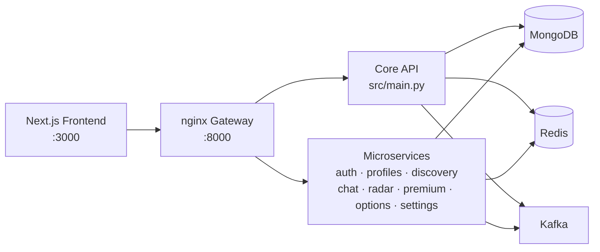

> 📖 **Technical documentation — developer reference.** The short public version of the project lives in [../README.en.md](../README.en.md).

<div align="center">

**English** | [Español](README.md)


# Red Thread (RETH)

**Meaningful connections inspired by the legend of the red thread.**

[](https://github.com/leoramzmusic/RedThread-main/actions/workflows/ci.yml)
[](../LICENSE)
[](https://nextjs.org/)
[](https://fastapi.tiangolo.com/)
[](https://nodejs.org/)
[](https://www.python.org/)

</div>

---

Red Thread is a social network for **meeting people with purpose** —romance, friendship, dating or just talking— built for adults and designed with safety as a priority. It combines affinity-based discovery with contextual conversation, wrapped in a visual identity built around the red thread: the bond that, according to legend, ties those who are destined to find each other.

## Table of contents

- [Purpose and goals](#purpose-and-goals)
- [Features](#features)
- [How it works](#how-it-works)
- [Quick start](#quick-start)
- [Environment variables](#environment-variables)
- [Tests and code quality](#tests-and-code-quality)
- [Repository structure](#repository-structure)
- [Contributing](#contributing)
- [Community](#community)
- [License](#license)

## Purpose and goals

**The problem.** Dating and social apps usually prioritize volume over connection: cold profiles, conversations that die quickly and little protection against harassment. Red Thread exists to offer a more human and safe experience, where context (interests, energy, intentions) matters as much as first impressions.

**Immediate goals:**

- Consolidate discovery with transparent affinity (a real percentage, not a black box).
- Keep the user and admin portals fast, accessible and multi-language (21 languages).
- Close the security audit and backend automated testing.
- Ship the mobile app (React Native) to production.

**Long-term vision:** themed communities, events, a company portal and a conversational wellbeing layer (the `care` module).

## Features

### ✅ Available today

- **Rich profiles**: bio, photos, interests, relationship goals, energy level, playlists (Spotify) and integrations.
- **Affinity discovery**: swipe, filters and a visible compatibility percentage.
- **Radar and proximity**: nearby users with explicit opt-in.
- **Conversation roulette**: random matching to break the ice.
- **Chat and visits**: active conversations with activity tracking.
- **Identity verification**: document/gesture checks with backend OCR.
- **Premium (Stripe)**: plans with advanced filters, super radar and rewind.
- **Care module**: assistance and wellbeing inside the platform.
- **Full user portal**: profile, security, subscription, discovery and settings.
- **Admin portal**: user management, verifications, metrics, support and a **visual appearance editor** (navbar, footer, landing sections, languages) published through the API.
- **Public landing page**: responsive, appearance-CMS driven, 21 languages.

### 🚀 In development / planned

- Mobile app with React Native (`mobile/`, Fastlane for delivery).
- Company Portal.
- Security and performance audits (see [`MASTER_BACKLOG.md`](MASTER_BACKLOG.md)).
- Themed communities, virtual events and automatic chat translation (product vision in [`requirements.md`](requirements.md)).

## How it works

A monorepo with a Next.js frontend, a FastAPI backend split into microservices and a reproducible local infrastructure via Docker:



- **`docker/docker-compose.local.yml`** brings up the whole stack: MongoDB 7, Redis, Kafka, the nginx gateway, the 8 microservices and the frontend.
- **CI** (GitHub Actions): frontend with `eslint + tsc + jest`, backend with `flake8 + pytest` on Python 3.11 / Node 20.
- Advanced infrastructure lives in `infra/`, `k8s/` (Kubernetes manifests) and `architecture/` (design documents).

## Quick start

### Option A — Full stack with Docker (recommended)

Requirements: [Docker](https://www.docker.com/) with Compose.

```bash
git clone https://github.com/leoramzmusic/RedThread-main.git
cd RedThread-main
docker compose -f docker/docker-compose.local.yml up --build
```

- Frontend: http://localhost:3000
- API Gateway: http://localhost:8000

### Option B — Manual (development)

**Requirements:** Node.js 20+, Python 3.11+, MongoDB 7 and Redis running locally.

```bash
git clone https://github.com/leoramzmusic/RedThread-main.git
cd RedThread-main

# Backend (terminal 1)
cd backend
pip install -r requirements.txt
python -m src.core.seed   # initial seed (optional on empty DB)
uvicorn src.main:app --reload --port 8000

# Frontend (terminal 2)
cd frontend
npm ci
npm run dev
```

> Kafka is optional for basic development; the event-driven services require it. `docker/docker-compose.local.yml` gives you Mongo + Redis + Kafka in one shot.

## Environment variables

| Variable | Component | Default | Description |
|---|---|---|---|
| `NEXT_PUBLIC_API_URL` | frontend | `http://localhost:8000` | Base API URL |
| `MONGODB_URL` | backend | `mongodb://localhost:27017` | MongoDB connection |
| `MONGODB_DB_NAME` | backend | `redthread` | Database name |
| `REDIS_HOST` / `REDIS_PORT` | backend | `localhost` / `6379` | Cache |
| `ENVIRONMENT` | backend | `local` | `local` · `dev` · `qa` · `prod` |
| `DEBUG` | backend | `false` | Verbose logging |

## Tests and code quality

The same commands run in CI:

```bash
# Frontend (frontend/)
npm run lint                # ESLint
npx tsc --noEmit            # Types
npm test                    # Jest (unit + components)

# Backend (backend/)
python -m flake8 src/ --max-line-length=120 --ignore=E501,W503
python -m pytest tests/ -v
```

## Repository structure

```
RedThread-main/
├── frontend/          # Next.js 16 · MUI · TypeScript · Jest
│   └── src/pages/portal-redthread/   # Admin portal
├── backend/           # FastAPI · MongoDB (Beanie) · Redis · Kafka
│   └── src/services/  # Microservices (auth, chat, radar, ...)
├── mobile/            # React Native (in development)
├── docker/            # local docker-compose + nginx gateway
├── k8s/ · infra/      # Kubernetes and infrastructure
├── architecture/      # Architecture documents
└── docs/              # Requirements, backlog, style guide, specs
```

## Contributing

Contributions are welcome!

1. **Fork** the repository and create your branch: `git checkout -b feat/my-improvement`
2. **Write the test first** that proves the bug or the feature (TDD is the repo's practice)
3. **Implement** and verify locally with the commands in [Tests and code quality](#tests-and-code-quality)
4. **Commit with convention**: `feat(chat): …`, `fix(auth): …` ([Conventional Commits](https://www.conventionalcommits.org/))
5. **Open a Pull Request** against `main` describing the what, the why and how it was tested

**Conventions:**

- Frontend: ESLint + strict TypeScript, tests with Jest/React Testing Library.
- Backend: flake8 (120 columns), type hints, tests with pytest.
- Design docs and specs live in `docs/` (pattern: `docs/superpowers/specs/`).
- No new `eslint-disable`/`# noqa` without justification in the PR.

## Community

| Channel | Status |
|---|---|
| [Issues](https://github.com/leoramzmusic/RedThread-main/issues) | ✅ Bugs, ideas and questions |
| Pull Requests | ✅ Code contributions |
| Discord | 🔜 *Coming soon* — `<!-- TODO(owner): paste invite -->` |
| Telegram | 🔜 *Coming soon* — `<!-- TODO(owner): paste link -->` |
| X / Twitter | 🔜 *Coming soon* — `<!-- TODO(owner): paste handle -->` |

> **Before publishing:** replace the `TODO`s above with your real links or drop the rows you won't use.

You can also support the project with a **donation** or by becoming a **sponsor** — reach out through Issues to coordinate. `<!-- TODO(owner): add GitHub Sponsors / BuyMeACoffee when available -->`

## License

Distributed under the [MIT License](../LICENSE) © 2025 Roberto Leonel Pérez Ramírez. You may use, modify and distribute the code while retaining the license notice.
