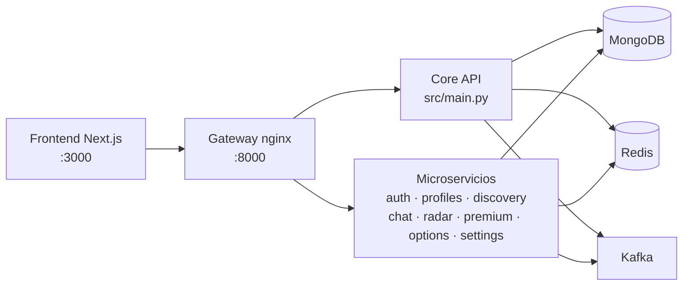

> 📖 **Documentación técnica — referencia para desarrolladores.** La versión pública y resumida del proyecto vive en [../README.md](../README.md).

<div align="center">

[English](README.en.md) | **Español**


# Red Thread (RETH)

**Conexiones significativas inspiradas en la leyenda del hilo rojo.**

[](https://github.com/leoramzmusic/RedThread-main/actions/workflows/ci.yml)
[](../LICENSE)
[](https://nextjs.org/)
[](https://fastapi.tiangolo.com/)
[](https://nodejs.org/)
[](https://www.python.org/)

</div>

---

Red Thread es una red social para **conocer personas con propósito** —amor, amistad, citas o simplemente platicar— pensada para mayores de edad y diseñada con la seguridad como prioridad. Combina descubrimiento con afinidad, conversación con contexto y una identidad visual construida alrededor del hilo rojo: el lazo que, según la leyenda, une a quienes están destinados a encontrarse.

## Índice

- [Propósito y objetivos](#propósito-y-objetivos)
- [Características](#características)
- [Cómo funciona](#cómo-funciona)
- [Inicio rápido](#inicio-rápido)
- [Variables de entorno](#variables-de-entorno)
- [Tests y calidad de código](#tests-y-calidad-de-código)
- [Estructura del repositorio](#estructura-del-repositorio)
- [Cómo contribuir](#cómo-contribuir)
- [Comunidad](#comunidad)
- [Licencia](#licencia)

## Propósito y objetivos

**El problema.** Las apps de citas y social suelen priorizar el volumen sobre la conexión: perfiles fríos, conversaciones que mueren y poca protección contra el acoso. Red Thread existe para ofrecer una experiencia más humana y segura, donde el contexto (intereses, energía, intenciones) importe tanto como la primera impresión.

**Objetivos inmediatos:**

- Consolidar el descubrimiento con afinidad transparente (porcentaje real, no caja negra).
- Mantener el portal de usuario y el portal admin siempre accesibles, rápidos y multi-idioma (21 idiomas).
- Cerrar la auditoría de seguridad y las pruebas automatizadas del backend.
- Llevar la app móvil (React Native) a producción.

**Visión a futuro:** comunidades temáticas, eventos, un portal para empresas y una capa de bienestar conversacional (módulo `care`).

## Características

### ✅ Disponibles hoy

- **Perfiles ricos**: bio, fotos, gustos, metas de relación, nivel de energía, playlists (Spotify) e integraciones.
- **Descubrimiento con afinidad**: swipe, filtros y porcentaje de compatibilidad visible → motor [CARE](./CARE_ALGORITHM.md) con [hoja de ruta](./CARE_ROADMAP.md).
- **Radar y cercanía**: usuarios cercanos con opt-in explícito.
- **Ruleta de conversación**: emparejamiento aleatorio para romper el hielo.
- **Chat y visitas**: conversaciones activas con seguimiento de actividad.
- **Verificación de identidad**: chequeo documental/gestual con OCR en el backend.
- **Premium (Stripe)**: planes con filtros avanzados, super radar y rewind.
- **Módulo de cuidado (`care`)**: asistencia y bienestar dentro de la plataforma.
- **Portal de usuario completo**: perfil, seguridad, suscripción, descubrimiento y ajustes.
- **Portal admin**: gestión de usuarios, verificaciones, métricas, soporte y **apariencia con editor visual** (navbar, footer, secciones del landing, idiomas) publicado vía API.
- **Landing público** responsive con CMS de apariencia y soporte de 21 idiomas.

### 🚀 En desarrollo / planeadas

- App móvil con React Native (`mobile/`, con Fastlane para despliegue).
- Portal de Empresa (Company Portal).
- Auditoría de seguridad y rendimiento (ver [`MASTER_BACKLOG.md`](MASTER_BACKLOG.md)).
- Comunidades temáticas, eventos virtuales y traducción automática en chat (visión de producto en [`requirements.md`](requirements.md)).

## Cómo funciona

Monorepo con frontend Next.js, backend FastAPI descompuesto en microservicios y una infraestructura local reproducible con Docker:



- **`docker/docker-compose.local.yml`** levanta todo el stack: MongoDB 7, Redis, Kafka, gateway nginx, los 8 microservicios y el frontend.
- **CI** (GitHub Actions): frontend con `eslint + tsc + jest`, backend con `flake8 + pytest` en Python 3.11 / Node 20.
- Infraestructura avanzada en `infra/`, `k8s/` (manifests de Kubernetes) y `architecture/` (documentos de diseño).

## Inicio rápido

### Opción A — Stack completo con Docker (recomendada)

Requisitos: [Docker](https://www.docker.com/) con Compose.

```bash
git clone https://github.com/leoramzmusic/RedThread-main.git
cd RedThread-main
docker compose -f docker/docker-compose.local.yml up --build
```

- Frontend: http://localhost:3000
- API Gateway: http://localhost:8000

### Opción B — Manual (desarrollo)

**Requisitos:** Node.js 20+, Python 3.11+, MongoDB 7 y Redis corriendo en local.

```bash
git clone https://github.com/leoramzmusic/RedThread-main.git
cd RedThread-main

# Backend (terminal 1)
cd backend
pip install -r requirements.txt
python -m src.core.seed   # seed inicial (opcional en DB vacía)
uvicorn src.main:app --reload --port 8000

# Frontend (terminal 2)
cd frontend
npm ci
npm run dev
```

> Kafka es opcional para desarrollo básico; los servicios de eventos lo requieren. Con `docker/docker-compose.local.yml` obtienes Mongo + Redis + Kafka de una sola vez.

## Variables de entorno

| Variable | Componente | Defecto | Descripción |
|---|---|---|---|
| `NEXT_PUBLIC_API_URL` | frontend | `http://localhost:8000` | URL base de la API |
| `MONGODB_URL` | backend | `mongodb://localhost:27017` | Conexión a MongoDB |
| `MONGODB_DB_NAME` | backend | `redthread` | Base de datos |
| `REDIS_HOST` / `REDIS_PORT` | backend | `localhost` / `6379` | Caché |
| `ENVIRONMENT` | backend | `local` | `local` · `dev` · `qa` · `prod` |
| `DEBUG` | backend | `false` | Logging detallado |

## Tests y calidad de código

Los mismos comandos corren en CI:

```bash
# Frontend (frontend/)
npm run lint                # ESLint
npx tsc --noEmit            # Tipos
npm test                    # Jest (unit + componentos)

# Backend (backend/)
python -m flake8 src/ --max-line-length=120 --ignore=E501,W503
python -m pytest tests/ -v
```

## Estructura del repositorio

```
RedThread-main/
├── frontend/          # Next.js 16 · MUI · TypeScript · Jest
│   └── src/pages/portal-redthread/   # Portal admin
├── backend/           # FastAPI · MongoDB (Beanie) · Redis · Kafka
│   └── src/services/  # Microservicios (auth, chat, radar, ...)
├── mobile/            # React Native (en desarrollo)
├── docker/            # docker-compose local + nginx gateway
├── k8s/ · infra/      # Kubernetes e infraestructura
├── architecture/      # Documentos de arquitectura
└── docs/              # Requisitos, backlog, style guide, specs
```

## Cómo contribuir

¡Las contribuciones son bienvenidas!

1. **Haz fork** del repositorio y crea tu rama: `git checkout -b feat/mi-mejora`
2. **Escribe primero el test** que demuestra el bug o la feature (TDD es la práctica del repo)
3. **Implementa** y verifica localmente con los comandos de [Tests y calidad](#tests-y-calidad-de-código)
4. **Commitea con convención**: `feat(chat): …`, `fix(auth): …` ([Conventional Commits](https://www.conventionalcommits.org/))
5. **Abre un Pull Request** contra `main` describiendo el qué, el porqué y cómo se probó

**Convenciones:**

- Frontend: ESLint + TypeScript estricto, tests con Jest/React Testing Library.
- Backend: flake8 (120 columnas), type hints, tests con pytest.
- Documentos de diseño y specs: `docs/` (se usa el patrón `docs/superpowers/specs/`).
- Cero `eslint-disable`/`# noqa` nuevos sin justificación en el PR.

## Comunidad

| Canal | Estado |
|---|---|
| [Issues](https://github.com/leoramzmusic/RedThread-main/issues) | ✅ Bugs, ideas y preguntas |
| Pull Requests | ✅ Contribuciones de código |
| Discord | 🔜 *Próximamente* — `<!-- TODO(owner): pegar invite -->` |
| Telegram | 🔜 *Próximamente* — `<!-- TODO(owner): pegar enlace -->` |
| X / Twitter | 🔜 *Próximamente* — `<!-- TODO(owner): pegar handle -->` |

> **Antes de publicar:** sustituye los `TODO` de arriba por tus enlaces reales o elimina las filas que no vayas a usar.

También puedes apoyar el proyecto con una **donación** o convirtiéndote en **patrocinador** — escríbenos por Issues para coordinarlo. `<!-- TODO(owner): añadir GitHub Sponsors / BuyMeACoffee cuando exista -->`

## Licencia

Distribuido bajo la [Licencia MIT](../LICENSE) © 2025 Roberto Leonel Pérez Ramírez. Puedes usar, modificar y distribuir el código conservando la nota de licencia.
